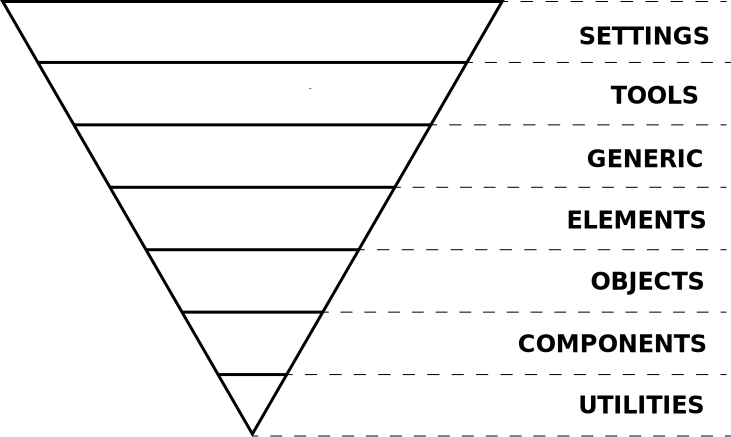
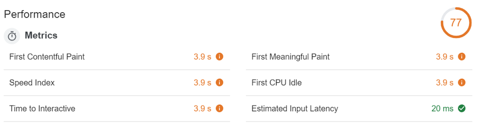
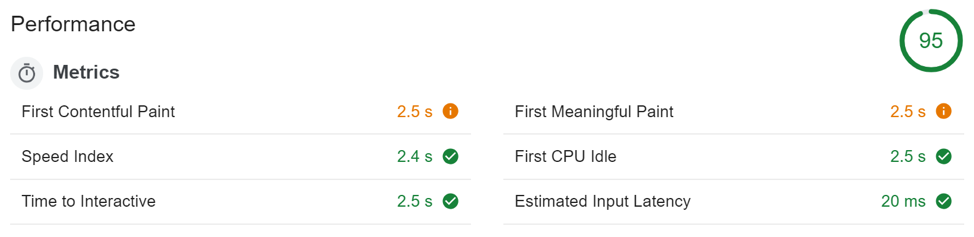
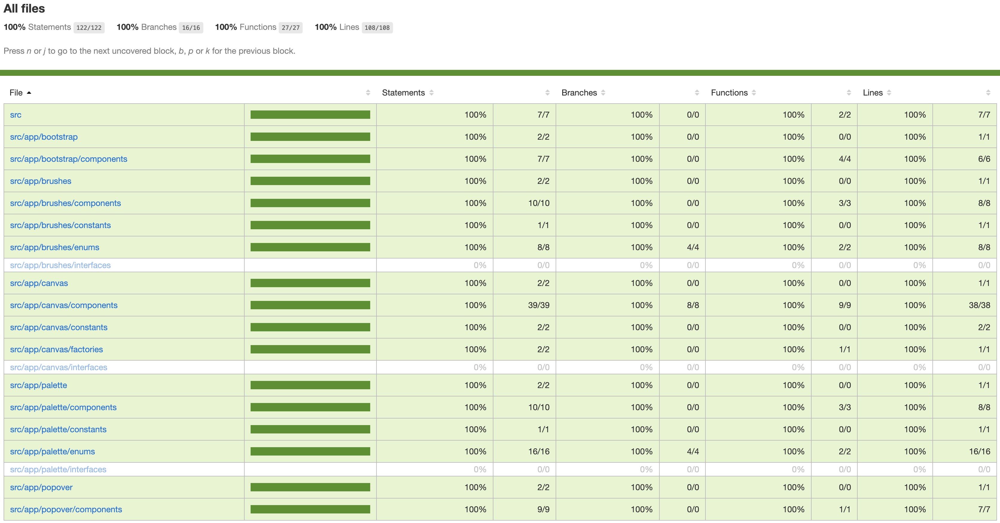

# Paint editor
From the client it has been proposed to make an application similar to windows paint that only have these actions:

- Undo / redo
- Colour selection
- Line thicknesses

For this project it has been requested to propose an architecture taking into account that it should
to be able to distribute as a multi-device app in the near future. This app goes
to have a fast rhythm of iterations, incorporating new functionalities like filters, etc.

## Architecture

### ITCSS
ITCSS Stands for Inverted Triangle CSS and it helps yo to organize your project SCSS files in such a way that you can
better deal with (not always easy-to-deal with) CSS specifics like global, namespaces, cascade and selector 
specificity.

Can be use with preprocessor or without them and is compatible with CSS methodologies lke BEM, SMACSS o OOCSS.

One of the key principles of ITCSS is that it separates your CSS codebase to several sections (called layers), 
which take the form of the inverted triangle:

Those layers are as follows:

- Settings - used with preprocessors and contain font, colors definition ,etc
- Tools - globally used mixins and functions. It's important not to outpu any CSS in the first 2 layers
- Generics - reset and/or normalize styles, box-sizing definition, etc. This is the 
layer which generates actual CSS
- Elements – styling for bare HTML elements (like H1, A, etc.). These come with default styling from the browser so we can redefine them here.
- Objects – class-based selectors which define undecorated design patterns, for example media object known from OOCSS
- Components – specific UI components. This is where the majority of our work takes place and our UI components are often composed of Objects and Components
- Utilities – utilities and helper classes with ability to override anything which goes before in the triangle, eg. hide helper class

The triangle also shows how styles represented by selectors are ordered in the resulting CSS: from generic styles to explicit ones, from 
low-specificity selectors to more specific ones.

### Framework

#### Angular 8
As a frontend framework, all of them have been taken into account, whether react, vuejs, angular or do it directly
with EcmaScript (VanillaJS). He has opted for Angular for its easy reuse of code with Ionic. In this way
We could have a hybrid mobile application in a simple way.

With both React and VueJS, there is its native framework, so we could get a native application, however,
Code reuse is not that simple.

In these two platforms we would have to carry out an additional development to convert any web element to a
native element and thus maximize the potential of the native part and improve the performance of a
hybrid application.

As a high rate of iterations is required, it has been pulled by a simpler mobile integration.

Angular 8 apart brings great performance improvements with its previous versions:

###### Angular 7.2.x
;

###### Angular 8.x

El speed index inicial de 2.4 es bastante bueno y con una compilación lazy y AOT se reduciría a menos de 2 segundos.

### Development

#### Running app
Run `npm run start`

#### Running TDD
Run `npm run tdd`

#### Running unit tests
Run `npm run test` to execute the unit tests via [Karma](https://karma-runner.github.io).

##### Coverage

